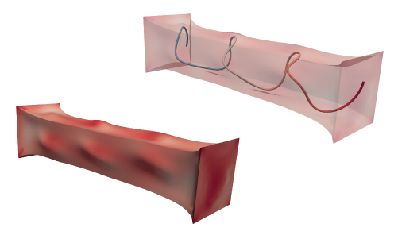
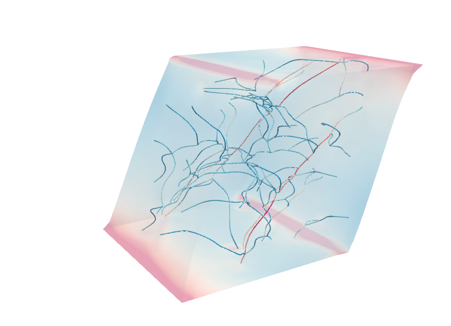

# Abaqus UEL for Spatial Embedded Fibers

Matlab-Abaqus pipeline to model embedded fibers in to hyperelastic solid base material (large deformations). Based on the work by Steinbrecher et al., _A mortar-type finite element approach for embedding 1D beams into 3D solid volumes_, 2020.



## Requirements

Commercial software
* Abaqus, Standard 
* Matlab

For post-processing and visualization
* Paraview

## Intro

We implement and make publicly available a mortar-type FE method for embedding beams in to 3D solid volumes, originally developed by Steinbrecher et al., 2020. 

The pipeline receives as **input**:
* Fiber structure (segment endpoints)
* Fiber geometry (straight, helix, sinusoidal undulations)
* Solid geometry (rectangular dimensions W,D,H in x,y,z axes, respecctively)
* Material parameters (solid, fiber, penalty parameter)
* Segmentation parameters (number of Gauss points, fiber resolution, plotting arguments)
* Boundary conditions (simple shear, uniaxial extension)
* Abaqus solver parameters (stepping, stabilization, etc.

**Output**:
Results of every converged step in *.vtk file format containing:
* Solid stress
* Fiber strain and cross section forces and moments.
* Interface line load between solid and the fibers
* Constraing violation metric.

Additionally, the pipeline outputs a Matlab structure, containing the components of strain energy, for both solid and fibers.

## Tutorial - Single Fiber

Everything runs through the main script "MainSingleFiber.m". First section of the script includes any settings/options needed to run the pipeline.
Only this part of the script should be modified.

First part of settings is the configuration options to define local paths and filenames.

```matlab
%------- CONFIGURATION OPTIONS --------------------------------------------
JobNum = 1; % Abaqus Job Number [0-9999]
JobDescription = 'Helix Coil Example'; % Analysis Description comment
WorkDir = './AbaqusWorkDir/'; % Local work directory for Abaqus
MatrixPaths = '/home/datastore/Sotiris/'; % Directory to save matrix *.txt
```

Next, the geometry and discretization options. Please note that at this point, the pipeline supports only *regular solid domains* (rectangular prisms).
The fibers are defined by providing the *endpoints* and then the undulation parameters, if any. Currently, are supported helix beams and sinusoidal undulations in two axes.

```matlab
%------- GEOMETRY OPTIONS -------------------------------------------------
% Solid Domain Dimensions
W = 1;  % Global X-direction
D = 2;  % Global Y-direction
H = 1;  % Global Z-direction

% Beam/Fiber Geometry
r0 = [W/2, 0.05*D, H/2]; % Start point
rf = [W/2, 0.95*D, H/2]; % End point

% Discretization
hsolid = 1/18; % Solid element length
hbeam = 1.0*hsolid; % Beam element length
dist_tol = 1e-8; % Distance tolerance for merging beam nodes

% Introduce Undulations
curve_type='helix'; % 'straight' OR 'helix' OR 'sin_und'
Ax = min([W,H])*0.4; Ay=[]; % Undulations Amplitude
wx=[]; wy=[];  % Unudations frequency (applicable only for 'sin_und'
nloops=3; % Complete loops (only for 'helix')
```

The next set of options, is related to constitutive modeling of the embedded fibers. This is where the material constants are defined, the beam order and the penalty parameter, as follows.
Please note that we consider in this example only nearly-incompressible neo-Hookean. However, the pipeline can be very easily modified to acccomodate any hyperelastic material model available in Abaqus.

```matlab
%------- CONSTITUTIVE MODEL OPTIONS ---------------------------------------
PenaltyConst = 1e-2; % Coupling penalty parameter
nGP = 6; % Number of Gauss points for beam domain integration
 
% Material and geometry
BeamOrder = 2; % Linear OR quadratic Timoshenko Beams OR Euler-Bernoulli 
BeamRadius = 0.01;
mod_ratio = 5000; % Beam-to-solid stiffness ratio
Ebeam  = 6.5; % Young's modulus for beam material
beam_nu = 0.495; % Poisson's Ratio for beams


% Solid Material Parameters
Matl = 'NHK'; %  NHK (Neo Hookean) 
kmurat = 1e3; % Bulk-to-shear modulus ratio (nearly incompressible)
```

Finally, please enter the boundary value problem options (displacement boundary conditions) and the Abaqus solver settings, as follows

```matlab
%------- BVP AND SOLVER OPTIONS -------------------------------------------
% Displacement Mode
RPL = 'SSxy'; % Displacement mode
X_disp = Lm; % Prescribed displacement

% Abaqus Solver Options Steps
nSteps = 1;
SolverOptions.InitStep = 1e-2;% Initial step
SolverOptions.minStep = 1e-4; % Min step
SolverOptions.maxStep = 1e-2; % Max step
SolverOptions.n_incr = 100; % Number of increments to ouput results
SolverOptions.STBL = true; % Stabilization boolean
SolverOptions.STBLfac = 2e-4; % If on, stabilization factor
```

The last set of options should not be significant or be changed. Feel free to reach out to the author for more details. The most useful of them is
```matlab
ReDoDiscretization = true; % Boolean to re-calculate coupling matrices
```
which dictates whether the pipeline should calculate again the coupling matrices, or just load the ones from previous run. Please note that the coupling matrices depend only on the geometry and the discretization parameters.


## Tutorial - Networks



In this case, everything runs through the main script "MainNetworks.m".
The only part that needs to be customized for each network each the section of the beam geometry.
It receives as input a matrix containing the endpoints for each fiber. As it loops through each fiber, it assigns a "curve type". Note that introducting undulations to the initially straight fibers, may cause some of them to lie outside the solid domain.
In that case, the user can exclude those segments, by specifying their IDs at the "exclude_branches" variable, or either assign a smaller undulations amplitude.

```matlab
%------- GEOMETRY OPTIONS -------------------------------------------------
% Solid Domain Dimensions
Lm = 26; % Cube scale for solid domain
W = Lm;  % Global X-direction
D = Lm;  % Global Y-direction
H = Lm;  % Global Z-direction


% Discretization
hsolid = 1/25*Lm; % Solid element length
hbeam = 1.1*hsolid; % Target beam element length
dist_tol = 1e-8; % Distance tolerance for merging beam nodes

% Load Fiber Data
FiberData = load('./N_30.mat');

% Undulations Options
Ampl_c = 0.1; % Undulation (fiber crimp) amplitude  
wx = 2; % Periodicity of Undulations
wy = 1;

% Loop individual fibers
exclude_branches = [89];
BeamAxes = {};
for i = 1:size(FiberData.Network.Segment,1)    
    
    r0 = FiberData.Network.Segment(i,1:3)*Lm;
    rf = FiberData.Network.Segment(i,4:6)*Lm;
    lfib(i) = norm(r0-rf); % Nominal fiber length
    
    curve_type='straight';
    if ~ismember(i,exclude_branches)
        curve_type='sin_und';
    end
            
    Ax = Ampl_c*lfib(i);
    Ay = Ampl_c*lfib(i);
        
    BeamAxes = [BeamAxes;{r0, rf, Ax, Ay, wx, wy, [], curve_type, hbeam}];    
end

```

## Post Processing Results

The pipeline generates for each substep, two groups *.vtk files containing all important scalar, vector and tensor fields. 
* B_{JobNum}_n: **Beam** files for Job= JobNum at substep "n"
* S_{JobNum}_n: **Solid** files for Job= JobNum at substep "n"

Each **Beam** file contains the following output:
* U: Displacement field
* GC: Coupling constraint violation (vector field -relative solid-beam displacement)
* LM: Lagrange multiplier field (vector field - interface load)
* SE, SK, SF, SM: Cross section strain, curvature, forces and moments (per Abaqus Definition)

Each **Solid** file contains the following output:
* U: Displacement field
* S: Cauchy stress tensor field

Recommended steps for post processing in Paraview:
* Load both series of **B** and **S** files
* Transluscent solid elements: change the opacity of the solid domain to any value less than 1.
* Smoothen the solid surfaces: apply the fiters in following order: 1) Extract Surface. 2) Generate Surface Normals. 3) CellDatatoPointData
* Render the 3D profile of the fibers by applying the "Tube" filter.

Additionally, the pipeline exports a Matlab structure in the local Abaqus Work Directory named "{BC}_AbaqusData.mat", where "BC" is a string representing the custom Boundary conditions.
In this structure, the user can find the following variables/quantities:
* RFdisp, RF: Rigid (prescribed) displacement and Reaction force, respectively (vector, in the Global coordinate system)
* ALLSE, ALLSD, ALLWK, ALLIE: Energy quantities as specified in Abaqus manual.
* NRGS: A substructure containing just the total beam strain energies: membrane (UmL), bending (Ub1L, Ub2) in the two cross section axes, shear (Us1L, Us2L) and torsional (UtrL)
* J: The determinant of the deformation gradient for each solid element (for incompressibility considerations).

## Troubleshoot

For any inquiries, additional help, customization or any other problem/concern/suggestions please you're more than welcome to reach out via email!
